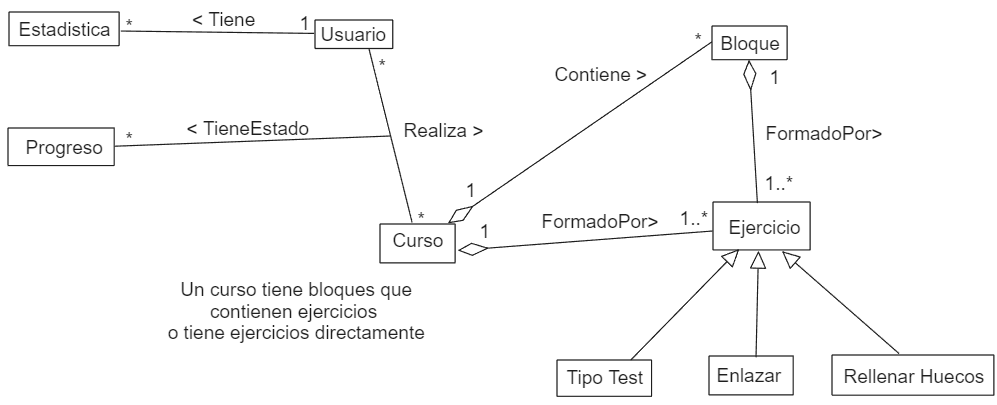

# PDSlingo

## Introducción
PDSlingo es una aplicación desarrollada en Java que permite a los usuarios aprender matemáticas y física de manera interactiva. Inspirada en Duolingo, la plataforma ofrece cursos creados por los propios usuarios, utilizando tarjetas con ejercicios para facilitar el aprendizaje progresivo.

## Índice
- [PDSlingo](#pdslingo)
  - [Introducción](#introducción)
  - [Índice](#índice)
  - [Actores](#actores)
  - [Casos de Uso](#casos-de-uso)
    - [Casos de Uso Desarrollados](#casos-de-uso-desarrollados)
      - [1. Iniciar sesión](#1-iniciar-sesión)
      - [2. Subir curso](#2-subir-curso)
  - [Modelado de Dominio](#modelado-de-dominio)
  - [Mockup](#mockup)

## Actores
- **Usuario**: Es el actor principal y único del sistema. Su motivación es aprender y mejorar en matemáticas y física a través de cursos interactivos.

## Casos de Uso
A continuación, se listan los principales casos de uso identificados en la aplicación:

| # | Caso de Uso | Descripción |
|---|---------------------------|------------------------------------------------|
| 1 | Registrarse | Permite a un usuario crear una cuenta en el sistema. |
| 2 | Iniciar sesión | Autenticación del usuario para acceder a la plataforma. |
| 3 | Subir curso (JSON o YAML) | Permite a los usuarios subir cursos en formato JSON o YAML. |
| 4 | Encontrar un curso | Buscar cursos por nombre o tipo de contenido. |
| 5 | Realizar curso | Completar los ejercicios de un curso seleccionado. |

### Casos de Uso Desarrollados

#### 1. Iniciar sesión
**Descripción:** Permite a un usuario autenticarse en el sistema.

**Precondiciones:**
- El usuario debe estar registrado en la plataforma.
- Debe contar con credenciales válidas (correo electrónico y contraseña).

**Flujo principal:**
1. El usuario introduce su correo electrónico y contraseña.
2. El sistema valida las credenciales.
3. Si son correctas, el usuario accede a la plataforma.
4. Si son incorrectas, se muestra un mensaje de error.

**Postcondiciones:**
- El usuario obtiene acceso a su perfil y funcionalidades del sistema.
- Se almacena la sesión activa del usuario en la plataforma.

#### 2. Subir curso
**Descripción:** Permite a un usuario subir un nuevo curso en formato JSON o YAML.

**Precondiciones:**
- El usuario debe estar autenticado en la plataforma.
- Debe contar con un archivo de curso en formato JSON o YAML válido.

**Flujo principal:**
1. El usuario accede a la sección de subida de cursos.
2. Selecciona un archivo en formato JSON o YAML.
3. El sistema valida el formato del archivo.
4. Si es válido, se almacena el curso en la plataforma.
5. Si no es válido, se muestra un mensaje de error.

**Postcondiciones:**
- El curso queda disponible para su consulta y realización por otros usuarios.
- Se almacena la información del curso en la base de datos.

## Modelado de Dominio
El siguiente diagrama representa el modelo de dominio inicial de la aplicación:

## Mockup

Próximamente...

